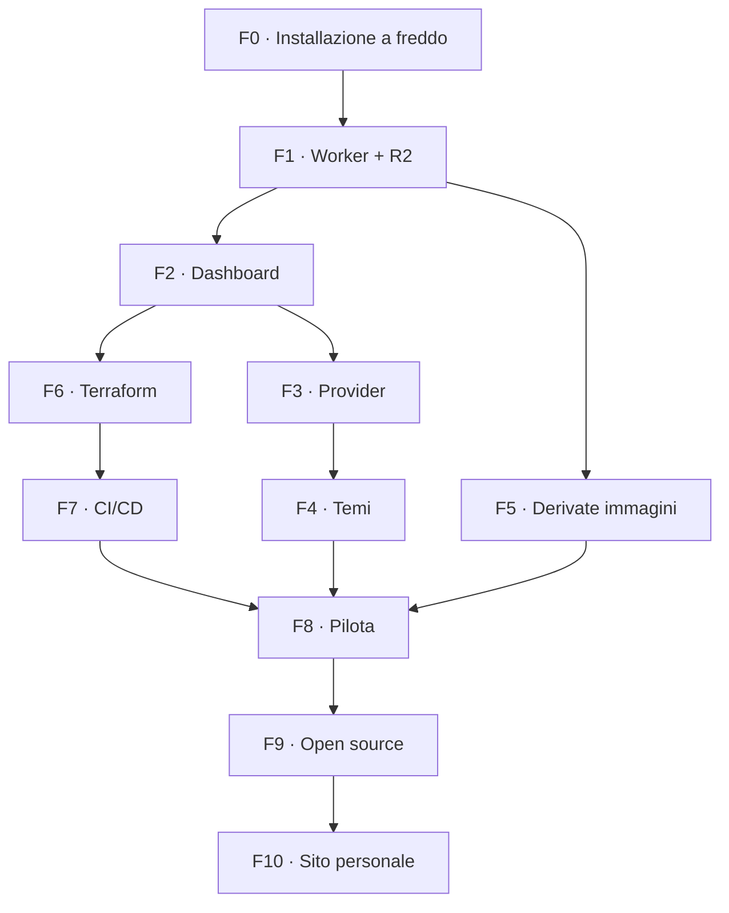

# Roadmap — PhotoPortfolio Template

**Data:** 20 settembre 2026
**Premessa:** vedi `docs/platform-direction.md`. Se una fase qui contraddice una decisione lì, vale il documento di direzione.
**Sostituisce:** la bozza `photo_portfolio_platform_roadmap.md`.
**Unità di stima:** una *sessione* = 2–4 ore di lavoro concentrato, come in `piano-implementazione.md`.

---

## 1. Obiettivo

Portare `PhotoPortfolioTemplate` da boilerplate Drive-based a template fotografico self-hosted che uno sviluppatore può installare sul proprio account Cloudflare e consegnare come sito funzionante, gestendone poi i contenuti da una dashboard protetta.

Il percorso è ordinato in modo che **ogni fase lasci il repo in uno stato funzionante e dimostrabile**. Non esiste un punto in cui il progetto è metà rotto in attesa della fase successiva.

## 2. Come leggere le stime

Le stime coprono: analisi del codice esistente, implementazione, aggiornamento dei test, esecuzione di build e test, documentazione minima, una revisione per fase.

Non coprono — e sono le voci che storicamente costano di più:

- propagazione DNS, trasferimenti di dominio, attese esterne;
- stranezze dell'account Cloudflare e prima configurazione di Zero Trust;
- iterazioni visuali sui temi (potenzialmente illimitate);
- il tempo del destinatario pilota, che non controlli.

**Nota onesta sul totale.** Il percorso completo sta intorno alle **24–37 sessioni**. È sensibilmente più della stima delle bozze precedenti (10,5–17 giornate), e la differenza non è pessimismo: quelle stime davano 1,5–2,5 giornate a una dashboard con preview, bozza/pubblicato, revisioni e rollback, quando la dashboard *esistente* — che fa molto meno — ha richiesto sessioni intere solo per il restyling. Qui la dashboard v1 è stata ridotta a ciò che serve davvero (vedi direzione §10), ma il tempo per portarla e generalizzarla resta reale.

Il numero che conta non è il totale: è che **dopo la fase 2 hai già un template che fa tutto quello che fa oggi il tuo sito personale**, e dopo la fase 8 hai un'installazione vera nelle mani di qualcun altro.

## 3. Sequenza

| Fase | Contenuto | Stima |
|---|---|---|
| F0 | Installazione a freddo e destinatario reale | 1 |
| F1 | Worker, R2 e API dati | 3–5 |
| F2 | Dashboard `/admin` protetta | 4–6 |
| F3 | Provider normalizzati e test di contratto | 2–3 |
| F4 | Temi e token consolidati | 2–3 |
| F5 | Derivate delle immagini | 2–3 |
| F6 | Modulo Terraform | 3–4 |
| F7 | CI/CD e ambienti | 2–3 |
| F8 | Consegna pilota | 2–3 |
| F9 | Release open source e case study | 2–4 |
| F10 | Riallineamento del sito personale | 1–2 |



F4 e F5 possono procedere in parallelo alle fasi infrastrutturali: toccano file diversi.

---

## F0 — Installazione a freddo e destinatario reale

**Perché per prima.** Tutto il resto assume che il template sia installabile da qualcun altro. Nessuno l'ha mai verificato. Un'ora di prova ora vale più di tre fasi di pianificazione.

**Attività**

- Clonare il template in una cartella nuova, come farebbe un destinatario, seguendo solo `README.md` e `SETUP.md`.
- Cronometrare e annotare **ogni** punto di attrito: passaggio non documentato, valore da indovinare, errore poco chiaro, prerequisito implicito.
- Verificare che `npm test` e `npm run build` passino da clone pulito.
- Identificare il **primo destinatario reale** fra gli amici sviluppatori: nome, che tipo di foto, se ha già un dominio, se ha già un account Cloudflare.
- Chiedergli cosa si aspetta di poter fare da solo dopo la consegna. La risposta vincola lo scope di F2.

**Deliverable:** lista degli attriti, che diventa il backlog di dettaglio delle fasi successive; un destinatario con un nome.

**Fatto quando:** esiste la lista, ed è stata usata per correggere `README`/`SETUP` nei punti più evidenti.

**Stima:** 1 sessione.

---

## F1 — Worker, R2 e API dati

**Obiettivo:** il sito pubblico del template legge album e foto da R2 attraverso un Worker, come già fa il sito personale.

**Attività**

- Portare `src/worker.js` e `src/worker/{http,data-routes}.js` dal sito personale, rimuovendo i riferimenti personali.
- Portare `src/providers/{r2,data}.js`.
- Definire la forma dei JSON runtime (`site`, `albums`, manifest per album) e documentarla.
- Spostare gli album da `config/albums.config.js` a dati runtime, mantenendo il file di config come sorgente della **modalità base**.
- Configurare `wrangler.jsonc` con ambienti distinti e binding R2.
- Gestire il caso "manifest assente" (album appena creato) come stato normale, non come errore.
- Test del Worker con gli helper già presenti nel sito personale.

**Fatto quando:** il template in modalità avanzata mostra album e foto lette da un bucket R2; in modalità base continua a funzionare da `albums.config.js`; test e build verdi.

**Stima:** 3–5 sessioni.

---

## F2 — Dashboard `/admin` protetta

**Obiettivo:** il destinatario gestisce i contenuti senza toccare il codice.

**Scope v1** (vedi direzione §10 — tutto il resto è escluso deliberatamente): creazione e modifica album, upload con compressione, riordino foto, scelta cover, testi album, profilo/bio/social.

**Attività**

- Portare `src/admin/` (API, encoder, EXIF, naming, pipeline, preview, router, sortable, status, upload-manager, viste) rimuovendo i riferimenti personali.
- Portare `src/worker/{admin-routes,access-jwt}.js` e `src/shared/content-rules.js`.
- Rendere configurabili le email amministratore e il team domain di Access.
- Validazione sia nel browser sia nel Worker: il Worker non si fida mai del client.
- Verificare che nessun token Cloudflare raggiunga il browser.
- Portare e adattare i test delle viste e delle route amministrative.

**Fatto quando:** da un'installazione pulita, un utente autorizzato crea un album, carica foto, riordina, sceglie una cover e modifica la bio; un utente non autorizzato non passa; un input non valido viene rifiutato dal Worker anche aggirando il browser.

**Stima:** 4–6 sessioni. È la fase più grossa: 18 file da portare e generalizzare.

---

## F3 — Provider normalizzati e test di contratto

**Perché dopo F1 e F2.** Un contratto disegnato con una sola implementazione reale prende la forma di quella implementazione. Con Drive e R2 entrambi funzionanti, il contratto si scrive sulle differenze vere.

**Attività**

- Consolidare `src/providers/provider.js`: `getSite`, `getAlbums`, `getAlbum(slug)`, `getPhotos(slug)`.
- Definire i modelli `SiteProfile`, `Album`, `Photo` con campi obbligatori, opzionali e fallback.
- Implementare il **provider locale** (manifest e immagini nel repo) per demo, sviluppo e test.
- Adeguare Drive e R2 al contratto.
- Scrivere **una sola** suite di test di contratto che gira su tutti e tre i provider.
- Verificare che nessun componente legga ID Drive, chiavi R2 o forme di risposta specifiche.

**Fatto quando:** la stessa suite passa su tre provider senza casi speciali, e cambiare provider è un solo valore di configurazione.

**Stima:** 2–3 sessioni.

---

## F4 — Temi e token consolidati

**Attività**

- Completare la tokenizzazione: nessun colore o misura hardcoded nei CSS dei componenti.
- Risolvere il debito dei font: il `<link>` a Google Fonts è duplicato in ogni file HTML, quindi cambiare coppia di font non è oggi un'operazione da solo `tokens.css`. Generare il link dai token, o documentare esplicitamente i due punti da toccare.
- Verificare che non esistano token referenziati ma mai definiti *(nel sito personale `hero.css` usa `var(--font-display)`, che non è definito in `tokens.css`: il titolo dell'hero eredita il font di sistema)*.
- Produrre **due preset completi** oltre a quello attuale, scelti fra le direzioni già esplorate nel canvas di design.
- Documentare come si crea un preset nuovo.
- Verificare responsive, contrasto, navigazione da tastiera e `prefers-reduced-motion`.

**Fatto quando:** cambiare preset non richiede modifiche ai componenti, e i preset reggono su mobile e desktop.

**Stima:** 2–3 sessioni, più le iterazioni visuali che decidi di concederti.

---

## F5 — Derivate delle immagini

**Perché conta.** È la funzionalità che il destinatario nota per prima, e oggi manca (direzione §8).

**Attività**

- Decidere le dimensioni: indicativamente griglia, lightbox, originale.
- Generare le derivate nella pipeline di upload (modalità avanzata) e in `scripts/compress.js` (modalità base).
- Aggiungere `srcset`/`sizes` ai componenti immagine.
- Fissare `width`/`height` o `aspect-ratio` per eliminare il layout shift.
- Definire il comportamento per le foto già caricate prima di questa fase.
- Misurare prima e dopo su una galleria reale, in rete lenta.

**Fatto quando:** una griglia non scarica più immagini a piena risoluzione, e il miglioramento è misurato, non supposto.

**Stima:** 2–3 sessioni.

---

## F6 — Modulo Terraform

**Attività**

- Bloccare le versioni di Terraform/OpenTofu e del provider Cloudflare.
- `providers.tf`, `variables.tf`, `outputs.tf` e file tematici.
- Risorse: bucket R2 produzione, bucket staging opzionale, record DNS, applicazione e policy Cloudflare Access.
- `terraform.tfvars.example` senza segreti.
- Documentare i permessi minimi dell'API token.
- Ignorare stato e variabili locali; documentare il backend remoto R2 come passo separato e opzionale, con il problema di bootstrap dichiarato.
- `fmt` e `validate` in CI.
- Provare `plan` e `apply` su risorse non di produzione.

**Fatto quando:** da repo pulito, `init`/`validate`/`plan` funzionano; produzione e staging non condividono dati; la dashboard è protetta da una policy esplicita; nessun secret nei file versionati.

**Stima:** 3–4 sessioni.

---

## F7 — CI/CD e ambienti

**Attività**

- Fissare e documentare la matrice di ownership Terraform / Wrangler.
- Workflow GitHub Actions: test, build, deploy.
- Separare staging e produzione; valutare un'approvazione manuale per la produzione.
- Secret via GitHub e `wrangler secret`.
- Smoke test post-deploy sulle rotte principali e sulle API.
- Documentare rollback del Worker.

**Fatto quando:** la pipeline si ferma prima del deploy se test o build falliscono, e un deploy non modifica risorse di Terraform.

**Stima:** 2–3 sessioni.

---

## F8 — Consegna pilota

**Obiettivo:** la verifica che tutto il resto esisteva per superare.

**Attività**

- Il destinatario individuato in F0 crea il repo da "Use this template".
- **Fa il setup lui**, sul proprio account, seguendo la documentazione. Tu osservi e prendi appunti senza intervenire finché non è bloccato.
- Ogni intervento tuo è un bug della documentazione: va annotato e corretto.
- Crea infrastruttura, distribuisce staging, accede alla dashboard.
- Carica almeno due album con foto vere.
- Verifica su mobile, desktop e rete lenta.
- Correggere setup, messaggi d'errore e documentazione sulla base di quanto osservato.

**Fatto quando:** esiste un sito online, su un dominio non tuo, gestito da qualcun altro, e la procedura documentata corrisponde a quella realmente eseguita.

**Stima:** 2–3 sessioni, escluse le attese esterne e i tempi del destinatario.

---

## F9 — Release open source e case study

**Attività**

- Scegliere e applicare la licenza del codice; dichiarare separatamente la licenza degli asset demo e l'esclusione delle fotografie personali.
- Riscrivere `README.md` (quick start onesto) e `CUSTOMIZING.md`.
- Documentare architettura, provider, temi, infrastruttura, costi e limiti dei piani gratuiti.
- Diagramma dell'architettura e screenshot dei preset e della dashboard.
- Pubblicare una demo in modalità locale (non richiede account Cloudflare a chi guarda).
- Controllo automatico che il repo non contenga nome, email, domini, ID Cloudflare o nomi di bucket personali.
- `CHANGELOG.md` e convenzione di versione; politica di aggiornamento dei fork (direzione §12).
- Case study: problema, decisioni, alternative scartate, diagramma, risultato, installazione indipendente.

**Fatto quando:** un visitatore capisce problema, soluzione e stack dalla pagina GitHub, e la guida parte da un account nuovo senza presupporre conoscenze interne.

**Stima:** 2–4 sessioni.

---

## F10 — Riallineamento del sito personale

**Ridotto deliberatamente.** I componenti dei due repo divergono di poche decine di righe (direzione §3.3): non è una milestone di integrazione, è una pulizia.

**Attività**

- Portare nel sito personale i miglioramenti generici maturati nel template: derivate immagini, token consolidati, correzioni dei componenti.
- Mantenere fuori tutto ciò che è del template: modalità demo, provider locale, setup.
- Conservare intatte API, sezione Software, CV e sincronizzazione multicanale.
- Rimisurare la duplicazione residua e registrarla.

**Fatto quando:** il sito personale beneficia dei miglioramenti senza dipendere dal template, e il numero aggiornato della duplicazione è scritto da qualche parte.

**Stima:** 1–2 sessioni.

---

## 4. Livelli di rilascio

| Livello | Fasi | Cosa hai in mano | Cumulativo |
|---|---|---|---|
| **R1 — Template completo** | F0–F3 | Il template fa tutto ciò che fa oggi il sito personale | 10–15 |
| **R2 — Consegnabile** | F4–F8 | Infrastruttura riproducibile e un'installazione reale non tua | 19–29 |
| **R3 — Pubblico** | F9 | Repo open source presentabile come case study | 21–33 |
| **R4 — Ecosistema** | F10 | Sito personale riallineato | 22–35 |

**R1 è già un risultato pubblicabile** come anteprima tecnica. **R2 è il primo livello che dimostra la tesi del progetto**: qualcun altro lo usa davvero.

### Variante rapida

Se vuoi una consegna reale prima possibile, sposta F6–F7 dopo F8: fai il primo setup a mano dalla dashboard Cloudflare, consegna, impara, e introduci Terraform per il **secondo** destinatario — quando avrai visto il setup manuale due volte e saprai esattamente cosa deve dichiarare.

Il motivo per **non** farlo: se la proposta di valore verso amici sviluppatori è "esegui `terraform apply` sul tuo account", allora il pilota *è* il test di Terraform, e rimandarlo significa testarlo più tardi con un destinatario in attesa. Consigliato l'ordine standard; la variante rapida è legittima se il primo destinatario ha fretta o è disponibile ora.

## 5. Metodo di lavoro

**Una fase alla volta.** Quando inizi una fase, scrivi il piano di implementazione dettagliato con `superpowers:writing-plans` e salvalo in `docs/superpowers/plans/`, come per M0–M8. Questo documento dice *cosa e perché*; quei piani dicono *come*, task per task, e vanno scritti sul codice reale del momento — non adesso, perché F1 e F2 cambieranno nomi e confini che F3 darebbe per scontati.

**Per ogni fase:** una issue epic suddivisa in task verificabili, branch `feature/f<numero>-<argomento>`, una PR con checklist, test e documentazione nella stessa PR, verifica su staging quando tocca Worker, R2 o dashboard.

**Quality gate**, da rispettare prima di dire "fatto": test verdi, build di produzione verde, nessun secret nel repo, nessuna regressione, documentazione aggiornata, verifica mobile e desktop quando cambia la UI, `terraform fmt` e `validate` sulle fasi infrastrutturali.

**Prima della v1.0.0**, in aggiunta: installazione da repo pulito, account Cloudflare indipendente, dashboard protetta verificata, rollback documentato, accessibilità di base, assenza di riferimenti personali, demo pubblica funzionante.

## 6. Divisione del lavoro

**Delegabile a un assistente:** porting e generalizzazione del codice esistente, test e fixture, adapter dei provider, file Terraform, workflow CI, script, documentazione tecnica, controlli di coerenza, changelog.

**Solo tu:** direzione visuale e approvazione dei preset, account/token/DNS Cloudflare, scelta della licenza, foto demo, test percettivi su dispositivi reali, rapporto con il destinatario pilota, contenuto del case study.

**Insieme:** forma dei modelli dati, revisione dell'esperienza di setup, test end-to-end, scelta di cosa resta fuori scope.

## 7. Rischi

| Rischio | Effetto | Risposta |
|---|---|---|
| Il porting di `admin/` è più intricato del previsto | Allunga F2 | Portare per sottoinsiemi funzionanti: prima album, poi upload, poi profilo |
| Iterazioni visuali sui temi senza fine | Allunga F4 | Due preset, decisi dal canvas già prodotto, poi stop |
| Il provider Terraform cambia schema | Allunga F6 | Versione bloccata, `validate` in CI |
| Terraform e Wrangler si contendono una risorsa | Blocca il deploy | Matrice di ownership scritta in F7, provata su staging |
| Zero Trust / Access ostico alla prima configurazione | Allunga F6/F8 | Documentare i passaggi manuali; provarli su un account pulito prima del pilota |
| Il destinatario pilota si smarca | Toglie la verifica vera | Individuarne **due** in F0; il secondo è la riserva |
| Scope della dashboard che ricresce | Allunga F2 | Direzione §10 è la lista chiusa: temi, revisioni e rollback non rientrano |
| Il sito personale diverge mentre lavori sul template | Allunga F10 | Rimisurare la duplicazione a F3 e a F10; sono poche righe, va tenuto così |

## 8. Cosa fare per primo

```text
F0.1 — Clone pulito in una cartella nuova, setup seguendo solo README/SETUP, cronometro acceso
F0.2 — Lista scritta di ogni attrito incontrato
F0.3 — npm test e npm run build da clone pulito
F0.4 — Individuare due possibili destinatari e sentire il primo
F0.5 — Correggere README/SETUP sui punti più evidenti emersi da F0.2
```

Al termine di F0, scrivere il piano dettagliato di F1 con `superpowers:writing-plans`, sui file reali.

## 9. Traguardo per il portfolio

Il progetto è presentabile come case study a partire da **R2**, quando esiste un'installazione reale non tua: prima di allora è un template ben fatto: dopo è una piattaforma con un utente.

La presentazione dovrebbe contenere: problema e destinatario, screenshot di due preset, diagramma dell'architettura, dashboard, modulo Terraform e pipeline, stack e test, link alla demo e al repo, un video breve dal setup al primo album caricato, e — la parte che distingue questo progetto da un template qualunque — **il racconto della consegna reale e di cosa si è rotto**.
